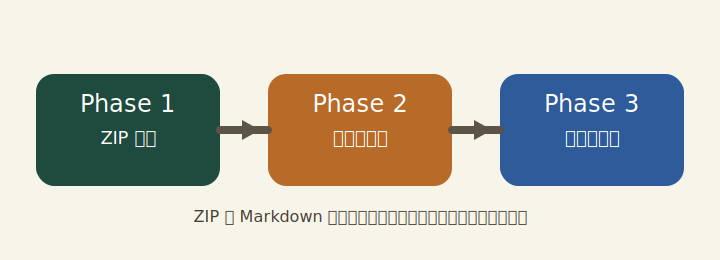

# WorkProcNavi 機能確認手順（ZIP 版）

この手順書は、ZIP パッケージの読込、ZIP 内 Markdown の解析、相対画像参照、コードブロック表示、手順本文内リンク、セッション保存、再開、エビデンス出力を確認するためのサンプルである。

## ZIP の取り込み確認

まず、ZIP パッケージとしての取り込みと概要表示を確認する。

### ZIP パッケージを読み込む

`workprocnavi-validation.zip` をアプリのホーム画面へドラッグ＆ドロップする。

- [ ] `.zip` ファイルをドロップするとエラーなく読み込まれる
- [ ] ZIP 内の Markdown が解析され、概要画面へ遷移する
- [ ] タイトル、フェーズ数、ステップ数が表示される

### 概要確認後に開始する

概要の内容を確認してから実行画面へ進む。

- [ ] 手順書タイトルが `WorkProcNavi 機能確認手順（ZIP 版）` と表示される
- [ ] フェーズ数とステップ数がこの手順書の構成と一致している
- [ ] 開始操作で実行画面へ遷移する

## 表示と操作の確認

ZIP 内アセットの表示と、実行中の基本操作を確認する。

### 画像の表示を確認する

下図は ZIP 内 `assets/phase-map.svg` を相対参照している。画像が表示されることを確認する。



- [ ] 画像が欠けずに表示される
- [ ] ウィンドウ幅を変えても画像表示が大きく崩れない
- [ ] ZIP 内アセット参照でもエラー表示にならない

### コードコピーと確認項目を確認する

次のコマンド例を使い、コードブロックのコピーと確認項目の操作を確認する。

```bash
printf 'zip verification\n'
```

- [ ] コードブロックが整形表示され、コピーボタンが利用できる
- [ ] コピー結果を貼り付けるとコードブロックの内容と一致する
- [ ] 確認項目のチェック状態が画面上で即時に反映される

### 手順本文内リンクを確認する

外部サイト URL は [Example Domain](https://example.com/) を使って確認する。

`file://` の確認では、検証環境に存在するフォルダとファイルを使用する。以下は形式確認用の例であり、存在しない場合は検証環境のパスへ置き換えてから確認する。

- macOS / Linux フォルダ例: [一時フォルダ](file:///tmp)
- macOS / Linux ファイル例: [一時ファイル](file:///tmp/workprocnavi-link-open-sample.txt)
- Windows フォルダ例: [一時フォルダ](file:///C:/Temp)
- Windows ファイル例: [一時ファイル](file:///C:/Temp/workprocnavi-link-open-sample.txt)

- [ ] 外部サイト URL をクリックすると、アプリ内ではなく既定の外部ブラウザで開く
- [ ] `file://` フォルダリンクをクリックすると、標準ファイルエクスプローラまたは Finder でフォルダが開く
- [ ] `file://` ファイルリンクをクリックしてもファイル本体は直接開かず、親フォルダ内で対象ファイルが表示される
- [ ] リンクを開いてもフェーズ位置、チェック状態、画面表示は維持される

## 保存・再開・完了確認

最後に、ZIP 入力時の保存、再開、完了後の出力を確認する。

### セッション保存と再開を確認する

途中で保存または中断を行い、ZIP 由来の手順書でも再開できるかを確認する。

- [ ] `workprocnavi-validation.session` が ZIP ファイルと同じ場所に作成される
- [ ] `.session` をドロップすると、前回のフェーズ位置とチェック状態が復元される
- [ ] 再開後も画像表示とチェック操作が継続して利用できる

### エビデンス出力を確認する

すべての確認が終わったら、完了後の出力ファイルを確認する。

- [ ] 完了時に `.log` ファイルが ZIP と同じ場所へ出力される
- [ ] `.log` に開始日時、完了日時、手順書名、確認項目結果が含まれる
- [ ] 完了後に `.session` が不要扱いとなり、設計どおりに後処理される
